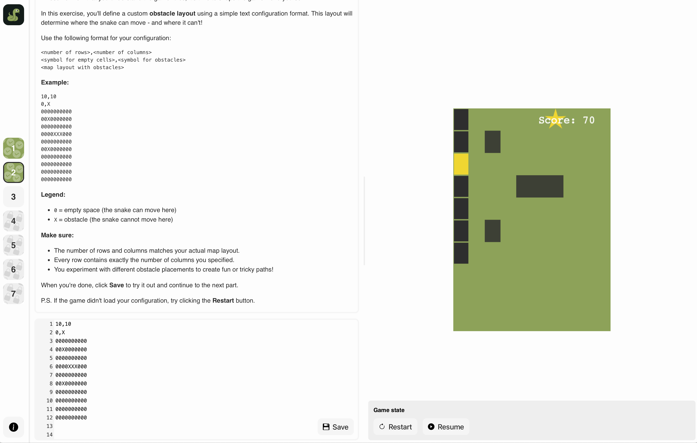

# 🐍 Snake Game Web IDE

This is an interactive **Web IDE** built to teach game development using the classic **Snake game** written in **Phaser.js**.
The IDE is designed for **educational workshops**, allowing learners to explore how games are built by playing, modifying, and debugging game logic in real time.

>[!NOTE]
> Created for a [**Royal Institution**](https://www.rigb.org) workshop to introduce students to game programming concepts using JavaScript and visual programming techniques.

## Features

- **Step-by-step Debugger** – Execute the game loop one frame at a time.
- **7 Learning Exercises** – From playing the game to writing the rules and implementing the snake’s controller.
- **Live Preview** – See the game update as you modify logic.

## Tech Stack
- Built using [Phaser.js](https://phaser.io/), a fast and fun HTML5 game framework.
- Uses Redux to manage game and UI state cleanly.
- Built with TypeScript, React, Redux, and Vite.js for blazing-fast development.

## 🚀 Getting Started

### Try it Online

You can try the project directly via GitHub Pages:  
[👉 Launch the Web IDE](https://st235.github.io/RoyalInstitution.IntroductionToGameDevelopment.v3/)

### 🧑‍💻 Local Development

1. Clone repo
2. Install dependencies:

```bash
npm install
```

3. Run the development server:

```bash
npm run dev
```

> [!TIP]
> Open your browser at http://localhost:5173/RoyalInstitution.IntroductionToGameDevelopment.v3 to see the Web IDE running

## 📚 Workshop Exercises Overview

| Exercise | Description |
| ---- | ---- |
| 1 | Play the game and observe how it behaves |
| 2 | Designing the level |
| 3 | Solving a maze with basic snake controller |
| 4 - 7| Implementing snake controller |

## About the Project

This IDE was developed as part of an educational outreach workshop hosted by the Royal Institution.
It provides a hands-on introduction to core programming and game development principles for students aged 10–14.

- [Slides](https://docs.google.com/presentation/d/1Mjba1zi_cBy_Yj6Ie7shPmTOuNbAomML247daykqZMo/edit?usp=sharing)

### Screenshots

| Exercise 1 | Exercise 2 | Exercise 3 |
| ---- | ---- | ---- |
|  |  |  |
